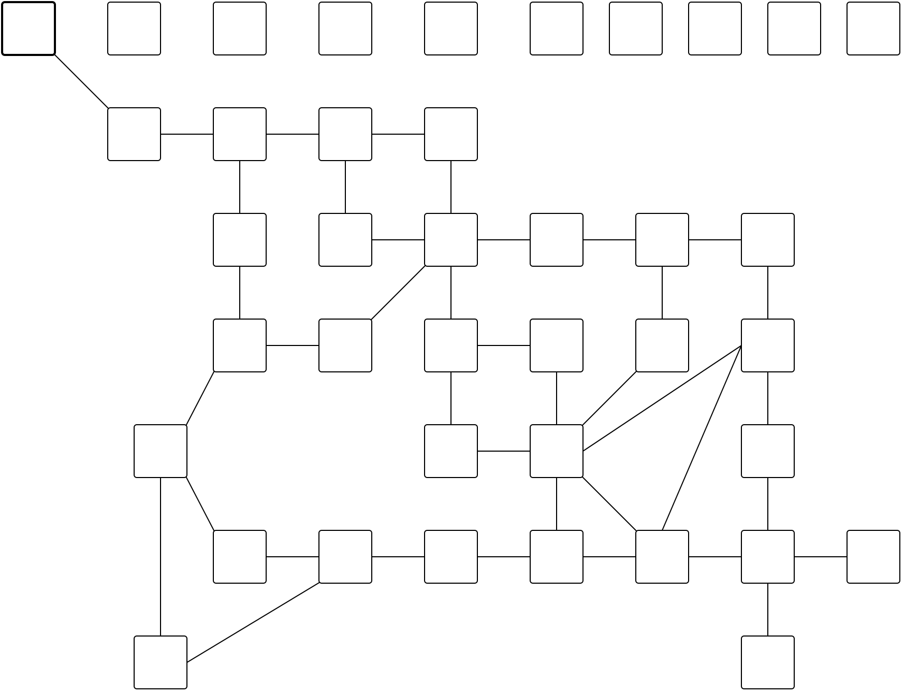

Some Twine2 tools

## twine2svg

`twine2svg` takes a Twine2 file and generates an SVG of the map from it.

```
twine2svg.rb 0.0.2 - convert a twine file to an SVG map

Usage: twine2svg.rb [options] twine_file

    -t, --with-title                 add passage title to passages
    -i, --ids                        add passage IDs to passages
    -e, --embed                      generate an SVG for embedding (just the <svg> tag)
    -s, --stroke=COLOR               sets the stroke color
    -f, --fill=COLOR                 sets the fill color
        --no-style                   do not embed style information
    -h, --help                       prints this help
```

Tested on Harlowe formatted games, not yet any others.

Example:



### Wishlist

* [ ] Tests/CI (learning one Ruby thing at a time, but those are next)
* [ ] Further styling options
* [ ] Fewer magic numbers (passage size/rect corner radius should be options)
* [ ] Re: previous - specifying a desired output size might be nice, but low priority
* [ ] Add twine title to SVG as an option
* [ ] Add ability to parse links other than `[[ links ]]`, such as `(link-goto:)` and `(goto:)`, off by default, but can turn on, with different styling (perhaps a `stroke-dasharray`)

## markdown2twine

*Coming soon.*

## twine2markdown

*Coming soon.*

# Rationale

I've been really itching to learn Ruby, and, as I was working on a [twine game](http://post-self.io/entry/gallery-exhibition) at the time, this seemed like a prime opportunity to do so! Formats aside, the twine itself is just an XML blob embedded in the file. Easy enough to send Nokogiri after.

Another reason, though, and the reason for the name Twinedown, is that I spend most of my day embedded in a text editor I have set up just the way I like for writing markdown, and I really wanted the ability to use that in Twine-land. Also, for proofing games written in Twine, I wanted the ability to export that to Markdown and proof there, then reload into twine.

I'm *very* new to Ruby, but would love critique and contributions. Will be getting CI and tests set up soon!
